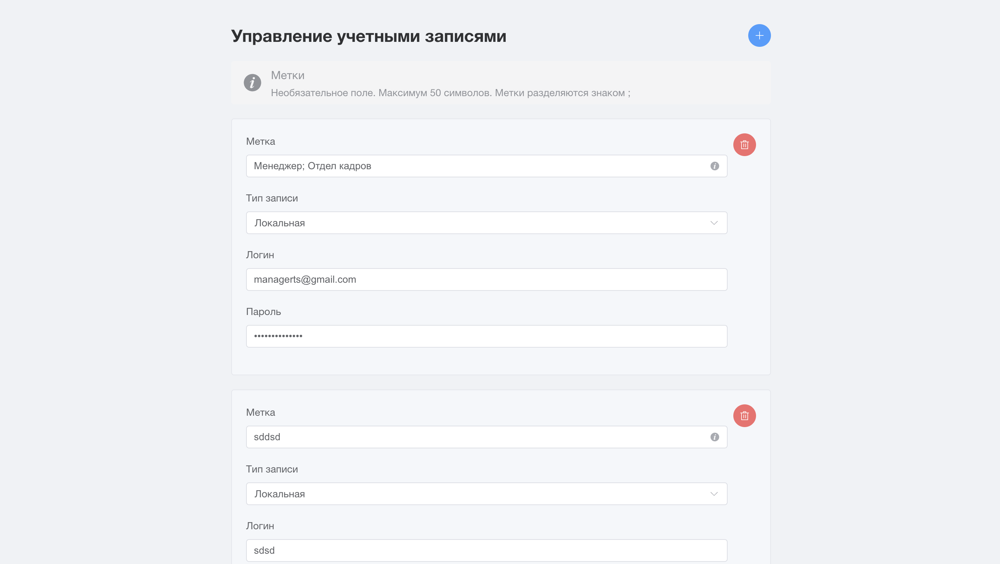

# Account Manager (Менеджер учетных записей)

## Описание проекта

Веб-приложение на Vue 3 + TypeScript для управления локальными и LDAP-учётными записями. 
Позволяет добавлять, редактировать, удалять записи с метками, валидировать ввод и сохранять данные в `localStorage`.

## Функциональность

- Добавление новых учетных записей
- Редактирование существующих учетных записей
- Удаление учетных записей
- Поддержка двух типов учетных записей: LDAP и локальные
- Добавление меток к учетным записям
- Валидация полей ввода
- Автоматическое сохранение данных в localStorage

## Технологии

- **Vue 3** - прогрессивный JavaScript-фреймворк для создания пользовательских интерфейсов
- **TypeScript** - типизированный язык программирования, расширяющий возможности JavaScript
- **Pinia** - легковесная библиотека управления состоянием для Vue
- **Element Plus** - библиотека компонентов пользовательского интерфейса для Vue 3
- **Vite** - современный инструмент сборки для быстрой разработки
- **UUID** - библиотека для генерации уникальных идентификаторов

## Структура проекта

```
├── src/
│   ├── components/            # Компоненты Vue
│   │   ├── AccountItem.vue    # Компонент одной записи (редактирование, удаление, валидация)
│   │   └── AccountManager.vue # Основной компонент управления учетными записями
│   ├── stores/                # Хранилища Pinia
│   │   └── accountStore.ts    # Хранилище для управления учетными записями
│   ├── types/                 # TypeScript типы
│   │   └── account.ts         # Типы для учетных записей
│   ├── App.vue                # Корневой компонент приложения
│   └── main.ts                # Точка входа в приложение
├── public/                    # Статические файлы
├── index.html                 # Основной HTML файл
└── package.json               # Зависимости и скрипты проекта
```

## Установка и запуск

### Предварительные требования

- Node.js (версия 16 или выше)
- npm или yarn

### Установка зависимостей

```bash
npm install
# или
yarn install
```

### Запуск сервера разработки

```bash
npm run dev
# или
yarn dev
```

Приложение будет доступно по адресу: http://localhost:5173/

### Сборка для продакшена

```bash
npm run build
# или
yarn build
```

### Предпросмотр сборки

```bash
npm run preview
# или
yarn preview
```
## Скриншот



## Особенности реализации

### Хранение данных

Мы используем Pinia + persistedstate, чтобы упростить архитектуру и обеспечить сохранение между сессиями без сервера.

### Типы учетных записей

- **LDAP** - учетные записи этого типа не требуют пароля
- **Локальная** - учетные записи этого типа требуют ввода пароля

### Валидация

Реализована валидация полей ввода с ограничениями:
- Логин: обязательное поле, максимум 100 символов
- Пароль: обязательное поле для локальных учетных записей, максимум 100 символов
- Метки: необязательное поле, максимум 50 символов, разделяются знаком ;

## Лицензия

MIT
